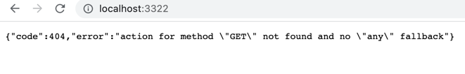
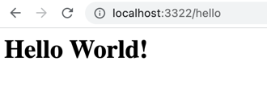
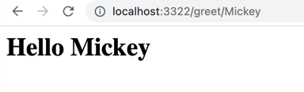
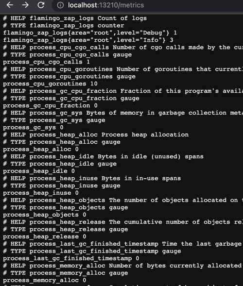
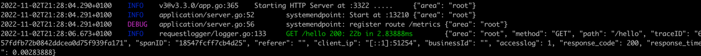

# Flamingo Tutorial "Example Helloworld"

The "example-helloworld" is a tutorial to learn the basic concepts of the web framework flamingo in a step by step process.
In this tutorial we will create a web application that renders a template with some dynamic data. 
At the end of the tutorial this application is production ready and can be deployed - for example in a container runtime.

You will come into contact with some basic concepts and principles when creating Go applications with the Flamingo web framework.

For example:
* The basic module structure in a flamingo project
* How to register routes and assign controller actions to them
* The usage of the dependency injection "dingo"
* The configuration concept and how to use configuration contexts
* What modules and features flamingo provides for "operational readyness" - like healthchecks, metrics, logging etc.

## Quickie: Run the (final) example

The tutorial is most helpful if you take the time and run through the steps below.
However - for those who do not have enough time - and just want to have a look at the final result (and do the turorial later ;-) ) - this is how to run the example: 
```bash
git clone git@github.com:i-love-flamingo/example-helloworld.git
cd example-helloworld
go run main.go serve
```
Open http://localhost:3322 to access the example application.

# Step by Step Tutorial

## Step 1: Create an empty Application

We start by creating a new Go application and we are adding the flamingo framework as a dependency:


```ssh
mkdir FlamingoExample
cd FlamingoExample
go mod init FlamingoExample
go get flamingo.me/flamingo/v3
```
The flamingo framework will also add its dependencies - for example the modules and libraries, that we will use later to enable the endpoints for operational readyness. 

The next thing you need to do is to edit the `main.go` file and create your very basic flamingo application.
This is simple - we just need to call the flamingo boostrap:

```go
package main

import "flamingo.me/flamingo/v3"

func main() {
  flamingo.App(nil)
}
```

The `flamingo.App()` method is the main entry point to run a flamingo application. 
It makes sure that the dependency injection is configured and will run the root command.
The method expects a list of flamingo modules. 
We will add modules later in this tutorial - for now we do not load any modules.

Lets start this very basic flamingo application:

```shell
go run main.go
```

What you see is the basic command printout of flamingo. ( Under the hood flamingo uses [cobra](https://github.com/spf13/cobra) as command library. )

```shell
Flamingo main

Usage:
  main [command]

Examples:
Run with -h or -help to see global debug flags

Available Commands:
  completion  generate the autocompletion script for the specified shell
  config      Config dump
  handler     Dump the Handlers and its registered methods
  help        Help about any command
  routes      Routes dump
  serve       Default serve command - starts on Port 3322

Flags:
  -h, --help   help for main

Use "main [command] --help" for more information about a command.
```

Lets run the flamingo application by using the "serve" command: `go run main.go serve`
And then open a browser with the url http://localhost:3322/

Since we did not configure any routes you will see the default 404 response of flamingo:


And on the command line you also can see the proper logging of flamingo.

## Step 2: Add the first module

Everything in a flamingo application should be bundled in modules. 
Modules help to structure the code in useful parts (bounded contexts).
So for our hello world example we will create a module "helloworld". 
Every module in flamingo need to provide an implementation of the module interface. 
This acts as an entry to configure your module.

As a best practice the modules inside a project should be created inside the folder `src`. 
So lets kickstart your first module by creating a file `src/helloworld/module.go` with the following content:

```go
package helloworld

import (
	"flamingo.me/dingo"
)

// Module is our helloWorld Module
type Module struct {}

// Configure is the default Method a Module needs to implement
func (m *Module) Configure(injector *dingo.Injector) {
	
}
```

And now add this module to the bootstrap in our `main.go` file:

```go
package main

import (
  "FlamingoExample/src/helloworld"
  "flamingo.me/dingo"
  "flamingo.me/flamingo/v3"
)

func main() {
  flamingo.App(
    []dingo.Module{
      new(helloworld.Module),
    },
  )
}

```

### Hello World Controller

As a best practice we recommend that a typical module in an flamingo application follows best practice layering to seperate business logic from interface logic etc.
Thats why we recommend to create controllers inside a folder "interfaces".


> **_Additional explanation:_**  We recommend clean code architectures and the usage of the architecture concept "ports and adapters".
> If you like you can read more about suggested [inner module structure](https://docs.flamingo.me/2.%20Flamingo%20Core/1.%20Flamingo%20Basics/3.%20Flamingo%20Module%20Structure.html) and [ports and adapters](https://docs.flamingo.me/2.%20Flamingo%20Core/1.%20Flamingo%20Basics/4.%20Ports%20and%20Adapters.html) in the documentation.

So lets create your first controller in the file `src/helloworld/interfaces/hello_controller.go` with a first action method:

```go
package interfaces

import (
	"context"
	"flamingo.me/flamingo/v3/framework/web"
)

// HelloController represents our first simple controller
type HelloController struct {
	responder *web.Responder
}

// Inject dependencies
func (controller *HelloController) Inject(responder *web.Responder) *HelloController {
	controller.responder = responder

	return controller
}

// Get is a controller action that renders the `hello.html` template
func (controller *HelloController) Get(ctx context.Context, r *web.Request) web.Result {
	// Calling the Render method from the response helper and render the template "hello"
	return controller.responder.Render("hello", nil)
}
```

Lets have a closer look at the code and walk through the important lines together:

* In line 8 we define the controller struct. In flamingo a web controller should use the `web.Responder` type to render responses. So we define this as a private dependency in our controller.
* In line 13 we are using the dependency injection feature of dingo (=the flamingo dependency injection) by implementing an Inject method, that requests all the dependency as parameters. Dingo will make sure that the controller will get its dependencies injected.
* In line 20 we are implementing our first action method. Each web action gets the go context and the current web request as parameter. 
* In line 22 we are using the Responder type to render a response. The first parameter is the name of the template that should be rendered - we will create it later.


> **_More about Dingo:_**  Dingo is the dependency injection that it used in flamingo.
> It supports all the features you expect from a modern DI solution, such as singletons, multi-bindings, scoping etc.
> The usage and interface is similar to Google Guice. You can read more about [Dingo](https://docs.flamingo.me/3.%20Flamingo%20Modules/1.%20dingo.html) in the documentation.


### Define routes
Next we need to tell flamingo under which route it should call the controller action.
Therefore you need to edit the `module.go` file inside your "helloworld" module:

```go
package helloworld

import (
  "FlamingoExample/src/helloworld/interfaces"
  "flamingo.me/dingo"
  "flamingo.me/flamingo/v3/framework/web"
)

// Module is our helloWorld Module
type Module struct{}

// Configure is the default Method a Module needs to implement
func (m *Module) Configure(injector *dingo.Injector) {
	
  // register our routes struct as a router Module - so that it is "known" to the router module
  web.BindRoutes(injector, new(routes))
}

// routes struct - our internal struct that gets the interface methods for router.Module
type routes struct {
  // helloController - we will defined routes that are handled by our HelloController - so we need this as a dependency
  helloController *interfaces.HelloController
}

// Inject dependencies - this is called by Dingo and gets an initializes instance of the HelloController passed automatically
func (r *routes) Inject(controller *interfaces.HelloController) *routes {
  r.helloController = controller

  return r
}

// Routes method which defines all routes handlers in module
func (r *routes) Routes(registry *web.RouterRegistry) {
  // Bind the path /hello to a handle with the name "hello"
  registry.MustRoute("/hello", "hello")

  // Bind the controller.Action to the handle "hello":
  registry.HandleGet("hello", r.helloController.Hello)
}
```

Lets walk through the code again: 
* In flamingo routes need to be registered with the help of a "RouterModule". A "RouterModule" needs to implement the method "Routes", where it can access the flamingo RouterRegistry. 
  This is what the code does in line 20 and 33.
* In our example we want to register our "Hello" action from our controller to answer on the route "/hello". Routing registration in flamingo works in two steps: First a route is assigned a so called handler. A handler is a string that represents a unique name - in this case "hello". 
  And second the handler gets an action assigned. (See line 38)
* Also here dependency injection is used, to pass a controller instance to the "RoutesModule". (See line 26)
* The RoutesModule itself is registered in the main Module configuration (See line 16).


> **_About Routing:_**  Flamingo uses the handler to support reverse routing: This means flamingo can generate correct links for defined handlers, which is very helpful when you want to adjust routes or domains later in a project.
> Also the handler concept allows to override routes in other modules,
> You can read more about [Routing](https://docs.flamingo.me/2.%20Flamingo%20Core/2.%20Framework%20Modules/Web%20module/ReadmeRouter.html) in the documentation.


### Add a template
Before we can see our "hello world" website we need to add a template engine and create our first template.

Flamingo supports different template engines that can be used for server side rendering. For our example we will simply use go templates.
So the first thing we need to do, is to add the "gotemplate" module to our flamingo application.

As before we do this by adding the module to our bootstrap. So we are editing the `main.go` file and add the module:

```go
package main

import (
	"FlamingoExample/src/helloworld"
	"flamingo.me/dingo"
	"flamingo.me/flamingo/v3"
	"flamingo.me/flamingo/v3/core/gotemplate"
)

func main() {
	flamingo.App(
		[]dingo.Module{
			new(gotemplate.Module),
			new(helloworld.Module),
		},
	)
}
```

> **_Additional explanation:_**  The "gotemplate.Module" registers an implementation for the flamingo TemplateEngine interface. This is following the concept of "ports and adapters". 
> So technically the gotemplate module uses Dingo to register the adapter (a concrete implementation) for the port. Read more about [ports and adapters](https://docs.flamingo.me/2.%20Flamingo%20Core/1.%20Flamingo%20Basics/4.%20Ports%20and%20Adapters.html) in the documentation.


The templates are saved in the "templates" folder by default. So please add a file "templates/hello.html" with the following content:

```html
<html>
    <body>
        <h1>Hello World!</h1>
    </body>
</html>
```

Now you can run the application again with `go run main.go serve`

And then access the route that we configured above by opening the url "http://localhost:3322/hello" in a browser.



Congratulation :-)

## Step 3: Using parameters in routes and pass data to template

The next feature we are trying is how to use URL parameters and how to pass data to the template.
Therefor we want that the application response to the route "/greet/<name>". "<name>" in the route is a dynamic path parameter. So if we call "http://localhost:3322/greet/mickey" we do expect to see "Hello Mickey".

At first we are defining a new action that receives the parameter and passes this parameter to the template:

```go

// Greet is a controller action that renders the `hello.html` template ands prints a provided URL param
func (controller *HelloController) Greet(_ context.Context, r *web.Request) web.Result {

	nickname, _ := r.Params["nickname"]

	return controller.responder.Render("hello", struct {
        Nickname string
	}{
        Nickname: nickname,
	})
}

```

As you can see in the code the "web.Request" instance gives access to the path parameter. The received value is then passed as the second argument in the "Render()" method call.

The passed data can simply be used in the template. So we are adjusting the template with the following content:

```html
<html>
<body>
    <h1>Hello {{ .Nickname }}</h1>
</body>
</html>
```

The next thing we need to do is to update the route definitions.
Therefore we are adjusting the routes inside the RoutesModule in the file `module.go` like this:

````go

// Routes method which defines all routes handlers in module
func (r *routes) Routes(registry *web.RouterRegistry) {
  // Bind the path /hello to a handle with the name "hello"
  registry.MustRoute("/hello", "hello")
  
  // Bind the controller.Action to the handle "hello":
  registry.HandleGet("hello", r.helloController.Hello)
  
  // Bind a route with a path parameter
  registry.MustRoute("/greet/:nickname", "helloWorld.greet")
  registry.HandleGet("helloWorld.greet", r.helloController.Greet)
}

````
As before we are defining a new route handler that has ":nickname" as the placeholder for the url path. 
Then we assign this route handler to the new action method.

Now please restart your application and open the url "http://localhost:3322/greet/Mickey"



That was easy - wasn't it.


> **_Additional infos:_**  There are different ways of passing dynamic data into an action: 
> * Use URL Path parameters (like in the example above)
> * Use GET Parameter in the Url - which you can access with `r.Query1("parametername")` helper
> * POST/Form data - which you can access with `r.Form()`. Or you may want to have a look into the separate [Flamingo "Form" module](https://github.com/i-love-flamingo/form).

## Step 4: Add a simple API

Of course flamingo can be used to build applications that provide various APIs.
For our example we are going to add a route "/api" and bind this to a simple action that returns some JSON response.

Therfore you need to add the following action method to your controller:

```go

// ApiHello is a controller action that renders Data
func (controller *HelloController) ApiHello(_ context.Context, r *web.Request) web.Result {
	// Calling the Render method from the response helper and render the template "hello"
	return controller.responder.Data(helloViewData{
		Name: "World",
	})
}
```

As you can see in this action, the responder's "Data" method is used to return the passed data as JSON.

The related route also need to be registered like this (inside your RouteModule):

```go
	registry.MustRoute("/api", "helloWorld.api")
	registry.HandleGet("helloWorld.api", r.helloController.ApiHello)
```


## Step 5: Introducing configurations

Flamingo comes with a configuration concept. Configurations are useful to configure behaviour and features insides your application. 
It is of course also used in flamingo core modules to enable certain features.
Configurations are requested as dependency and the dependency injection makes sure that the correct values are passed to the instances.

The main configuration for a flamingo application lives inside the folder "config" in the file config.yaml.
So lets create the file `config/config.yaml` with the following content:
```yaml
flamingo.debug.mode: false
```

What we typically want is, that during development we want to run flamingo in debug mode and also with higher log levels. Therefore flamingo support configuration contexts.
Please create a file `config/config_dev.yaml` with the following content:
```yaml
flamingo.debug.mode: true
```

And now run the application in "dev" context and print out the loaded configuration with the "config" command:
```shell
CONTEXT="dev" go run main.go config
```


> **_Additional infos:_**  Flamingo has a very flexible and powerful configuration concept. 
> In addition to the configuration contexts it supports multiple configuration areas (which is useful for localization) and validation of configurations options based on [cue](https://cuelang.org/docs/integrations/go/).
> Read more about the [configuration features](https://docs.flamingo.me/2.%20Flamingo%20Core/2.%20Framework%20Modules/Configuration.html) in flamingo.


## Step 6: Operational Readiness and other helpful modules

Flamingo comes with features and modules that makes it easy to run and monitor applications in production.
So lets add some typical modules to the application bootstrap:

```go
package main

import (
	"flamingo.me/dingo"
	"flamingo.me/example-helloworld/src/helloworld"
	"flamingo.me/flamingo/v3"
	"flamingo.me/flamingo/v3/core/gotemplate"
	"flamingo.me/flamingo/v3/core/healthcheck"
	"flamingo.me/flamingo/v3/core/requestlogger"
	"flamingo.me/flamingo/v3/core/zap"
	"flamingo.me/flamingo/v3/framework/opencensus"
)

// main is our entry point
func main() {
	flamingo.App([]dingo.Module{
		new(healthcheck.Module),
		new(opencensus.Module),
		new(zap.Module),           
		new(requestlogger.Module), 
		new(gotemplate.Module),   
		new(helloworld.Module),
	})
}
```
Lets go through all of them quickly:

### healthcheck module
This module uses an additional http endpoint on a separate port (default 13210) and adds useful endpoints:

* http://localhost:13210/status/ping - That responses with Status 200 and "OK" once the flamingo application is ready. This can be used as a readinessProbe in kubernetes for example.
* http://localhost:13210/status/healthcheck - End endpoint that returns the health of the application. You can register individual checks for your application - e.g. to check downstream dependencies. Flamingo modules like the sesssion module also make use of this.
* Tracing: This module also comes with support for jaeger and zipkin. You can enable the tracing exporters and configure the endpoint in the configuration.

### opencensus module

This module adds a metric andpoint that can be used as a scrap endpoint by tools like prometheus to fetch useful metrics.
Flamingo already provided a lot of standard metrics and you can use the opencensus module to register own metrics.

Try it out and open http://localhost:13210/metrics



### zap module
Make use of the popular zap logger.
With the usage of the flamingo configuration contexts you can configure the logging for production and development in a different way.

Configure json log format for production (which is useful for tools that collect logs like logstash) inside the file `config.yaml`
```yaml
core:
  zap:
    loglevel: Warn
    json: false
```

And configure log formatting for local development inside `config_dev.yaml`
```yaml
core:
  zap:
    loglevel: Debug
    colored: true
    json: false
```

### requestlogger module
This module provides access logs for requests to your application - they also include traceIds and spanIds.



As you see adding the most important features to provide traceability and monitoring was pretty easy.

> More about running [Flamingo in production](https://docs.flamingo.me/2.%20Flamingo%20Core/1.%20Flamingo%20Basics/5.%20Flamingo%20Production.html) can be found in the documentation.


Congratulations! You completed all steps in the Flamingo Hello World Example and learned some basic Flamingo features.
